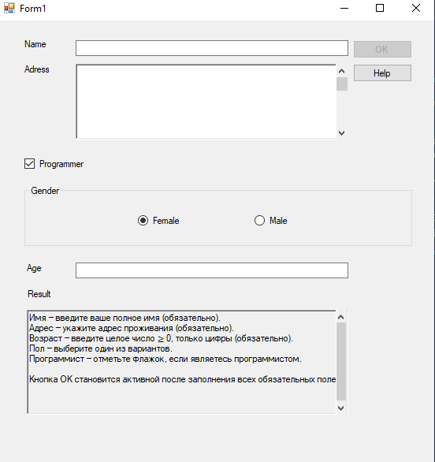
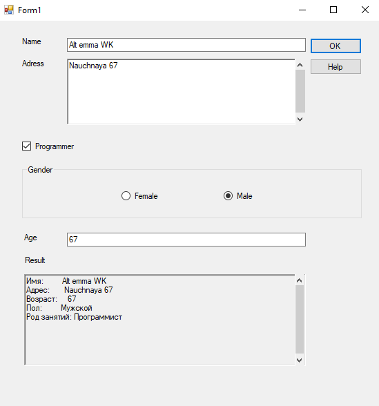

# Code

```
using System;
using System.Collections.Generic;
using System.ComponentModel;
using System.Data;
using System.Drawing;
using System.Linq;
using System.Text;
using System.Threading.Tasks;
using System.Windows.Forms;

namespace WindowFormsLessonTask
{
    public partial class Form1 : Form
    {
        public Form1()
        {
            InitializeComponent();

            // Результирующее поле — только для чтения
            richTextBox1.ReadOnly = true;

            // OK недоступен до заполнения полей
            OKButton.Enabled = false;

        }


        //name
        private void NameLabel_Click(object sender, EventArgs e)
        {
            NameTextBox.Focus();
        }

        private void NameTextBox_TextChanged(object sender, EventArgs e)
        {
            ValidateForm();
        }

        private void OKButton_Click(object sender, EventArgs e)
        {
            string sex = MaleRadioButton.Checked ? "Мужской" :
                    FemaleRadioButton.Checked ? "Женский" :
                                                "Не указан";
            string occupation = IsProgrammerCheckBox.Checked ? "Программист" : "Не указан";

            richTextBox1.Text =
                $"Имя:         {NameTextBox.Text}\r\n" +
                $"Адрес:       {AdressRichTextBox.Text.Trim()}\r\n" +
                $"Возраст:     {textBox1.Text}\r\n" +
                $"Пол:         {sex}\r\n" +
                $"Род занятий: {occupation}";
        }


        //adress
        private void AdressLabel_Click(object sender, EventArgs e)
        {
            AdressRichTextBox.Focus();
        }

        private void AdressRichTextBox_TextChanged(object sender, EventArgs e)
        {
            ValidateForm();
            AdressvScrollBar.Maximum = Math.Max(1, AdressRichTextBox.Lines.Length);
        }

        private void AdressvScrollBar_Scroll(object sender, ScrollEventArgs e)
        {
            // Прокрутка поля адреса по позиции скроллбара
            int pos = AdressvScrollBar.Value * (AdressRichTextBox.Font.Height + 2);
            AdressRichTextBox.SelectionStart = AdressRichTextBox.GetFirstCharIndexFromLine(
                Math.Min(AdressvScrollBar.Value, AdressRichTextBox.Lines.Length - 1));
            AdressRichTextBox.ScrollToCaret();
        }


        //help
        private void HelpButton_Click(object sender, EventArgs e)
        {
            richTextBox1.Text =
             "Имя — введите ваше полное имя (обязательно).\r\n" +
             "Адрес — укажите адрес проживания (обязательно).\r\n" +
             "Возраст — введите целое число ≥ 0, только цифры (обязательно).\r\n" +
             "Пол — выберите один из вариантов.\r\n" +
             "Программист — отметьте флажок, если являетесь программистом.\r\n\r\n" +
             "Кнопка OK становится активной после заполнения всех обязательных полей.";
        }


        //isProgrammer
        private void IsProgrammerCheckBox_CheckedChanged(object sender, EventArgs e) {}


        //sex
        private void SexGroupBox_Enter(object sender, EventArgs e) {}
        private void FemaleRadioButton_CheckedChanged(object sender, EventArgs e) {}
        private void MaleRadioButton_CheckedChanged(object sender, EventArgs e) { }


        //age
        private void AgeLabel_Click(object sender, EventArgs e)
        {
            textBox1.Focus();
        }

        private void textBox1_TextChanged(object sender, EventArgs e)
        {
            ValidateForm();
        }

        private void textBox1_KeyPress(object sender, KeyPressEventArgs e)
        {
            // Разрешаем только цифры и Backspace
            if (!char.IsDigit(e.KeyChar) && e.KeyChar != (char)Keys.Back)
            {
                e.Handled = true;
            }
        }

        //result
        private void ResultLabel_Click(object sender, EventArgs e) {}

        private void richTextBox1_TextChanged(object sender, EventArgs e)
        {
            ResultvScrollBar.Maximum = Math.Max(1, richTextBox1.Lines.Length);
        }

        private void ResultvScrollBar_Scroll(object sender, ScrollEventArgs e)
        {
            richTextBox1.SelectionStart = richTextBox1.GetFirstCharIndexFromLine(
                Math.Min(ResultvScrollBar.Value, richTextBox1.Lines.Length - 1));
            richTextBox1.ScrollToCaret();
        }


        private void ValidateForm()
        {
            bool nameOk = !string.IsNullOrWhiteSpace(NameTextBox.Text);
            bool addressOk = !string.IsNullOrWhiteSpace(AdressRichTextBox.Text);
            bool ageOk = int.TryParse(textBox1.Text, out int age) && age >= 0;

            OKButton.Enabled = nameOk && addressOk && ageOk;
        }

    }
}
```

#Result 




