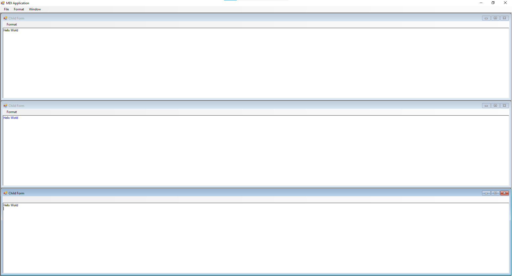

#code 

### ParentForm
```
using System;
using System.Collections.Generic;
using System.ComponentModel;
using System.Data;
using System.Drawing;
using System.Linq;
using System.Text;
using System.Threading.Tasks;
using System.Windows.Forms;

namespace WindowsFormsLessonTask6
{
    public partial class ParentForm : Form
    {
        public ParentForm()
        {
            InitializeComponent();
        }

        private void ExitMenuItem_Click(object sender, EventArgs e)
        {
            this.Close();
        }

        private void WindowCascadeMenuItem_Click(object sender, EventArgs e)
        {
            this.LayoutMdi(MdiLayout.Cascade);
        }

        private void TileMenuItem_Click(object sender, EventArgs e)
        {
            this.LayoutMdi(MdiLayout.TileHorizontal);
        }

        private void NewMenuItem_Click(object sender, EventArgs e)
        {
            ChildForm newChild = new ChildForm();

            newChild.MdiParent = this;
            newChild.Show();
        }
    }
}

```

### ChildFrom
```
using System;
using System.Collections.Generic;
using System.ComponentModel;
using System.Data;
using System.Drawing;
using System.Linq;
using System.Text;
using System.Threading.Tasks;
using System.Windows.Forms;

namespace WindowsFormsLessonTask6
{
    public partial class ChildForm : Form
    {
        public ChildForm()
        {
            InitializeComponent();
        }

        private void ToggleForegroundMenuItem_Click(object sender, EventArgs e)
        {
            if (ToggleForegroundMenuItem.Checked)
            {
                ToggleForegroundMenuItem.Checked = false;
                ChildTextBox.ForeColor = Color.Black;
            }
            else
            {
                ToggleForegroundMenuItem.Checked = true;
                ChildTextBox.ForeColor= Color.Blue;
            }

        }
    }
}

```

#result


