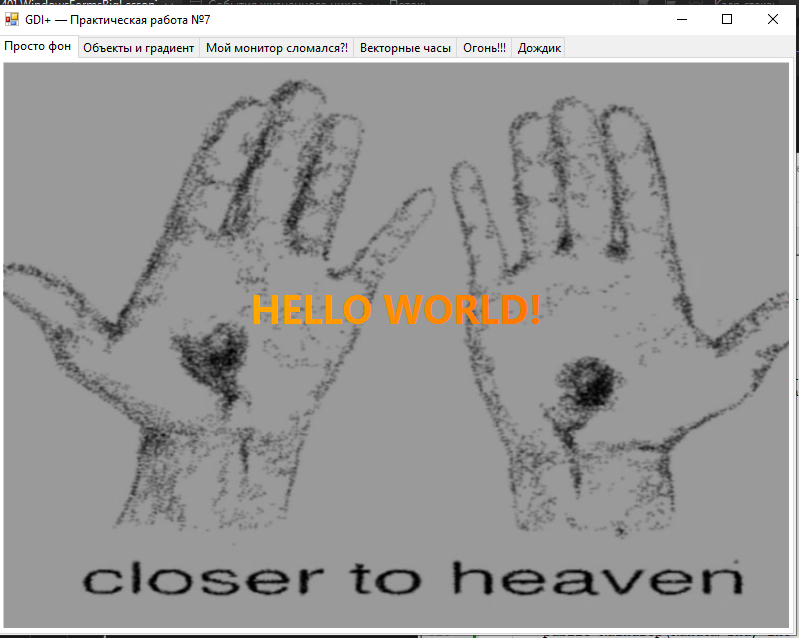
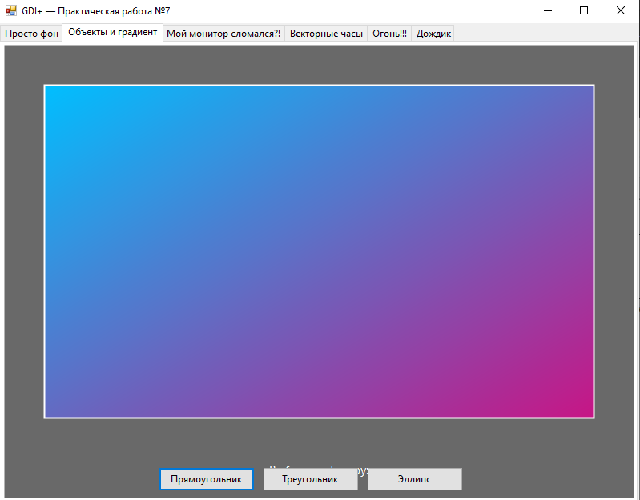
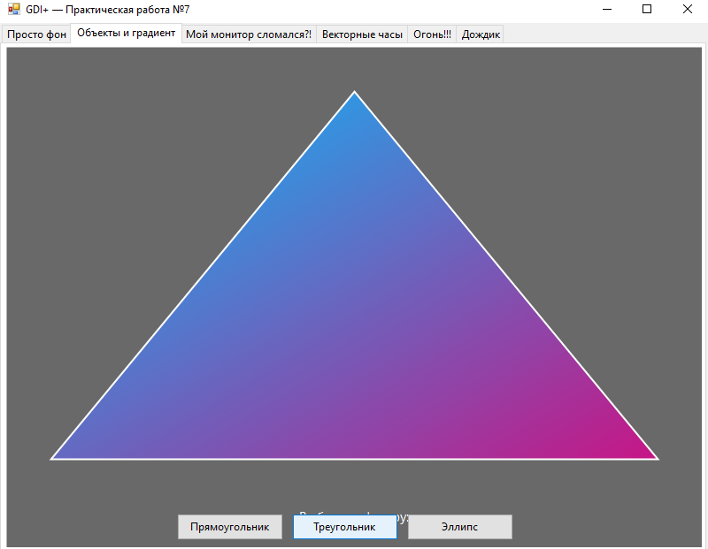
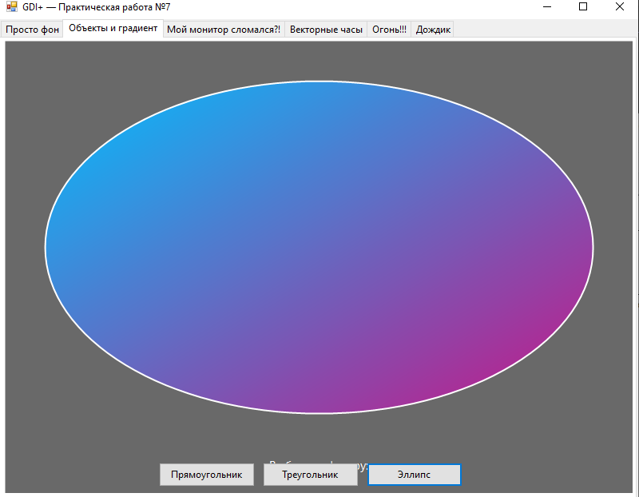
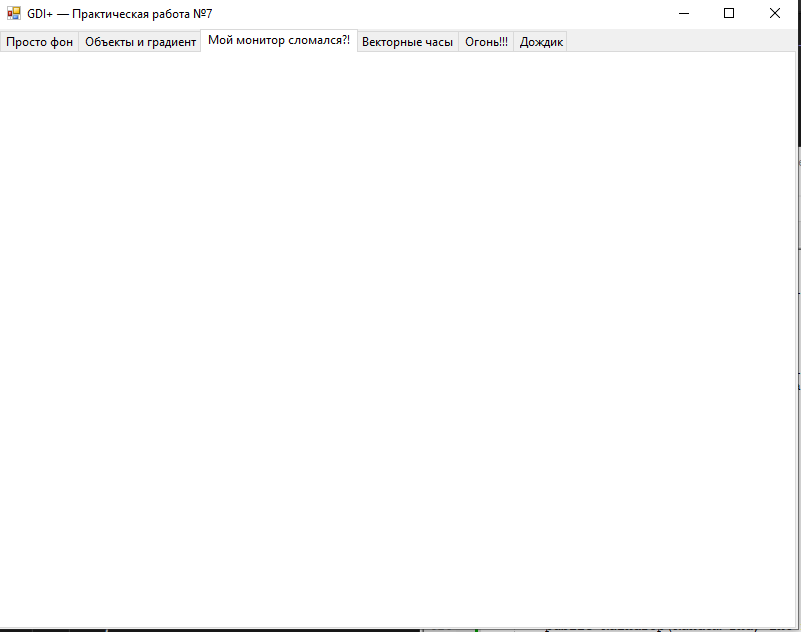
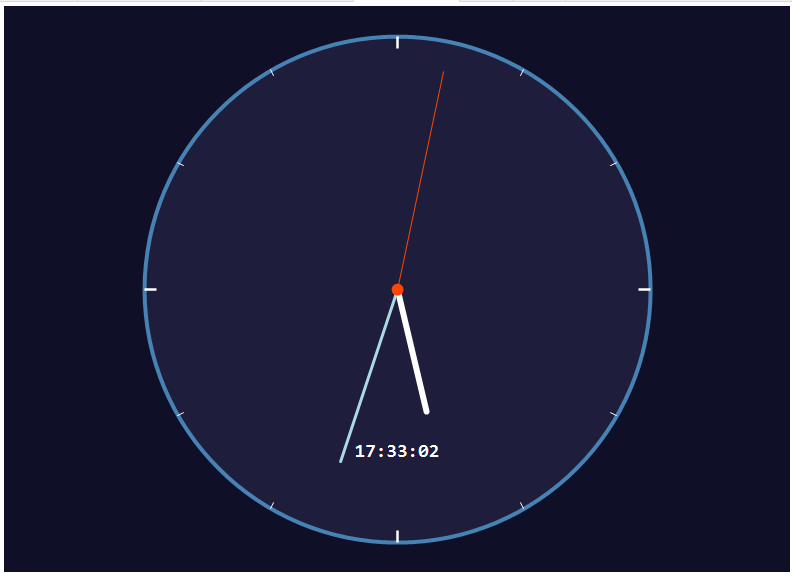
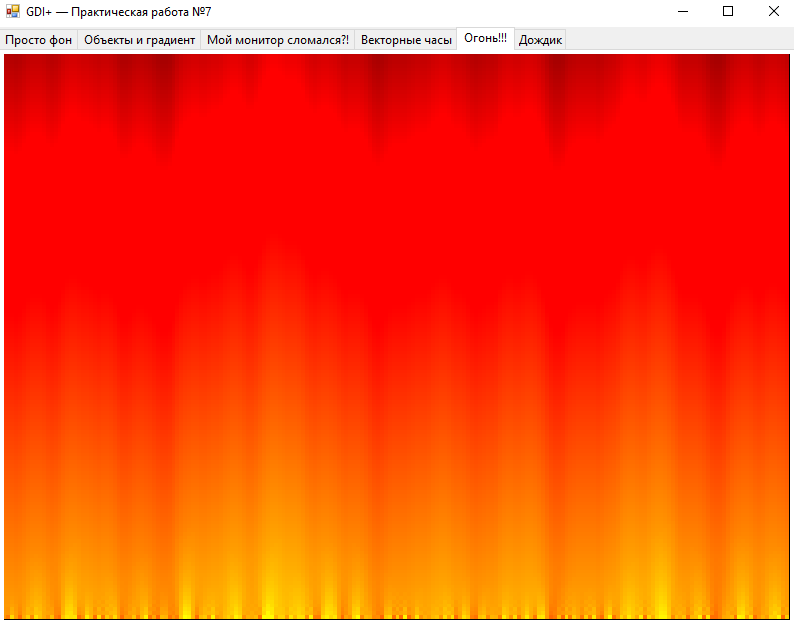
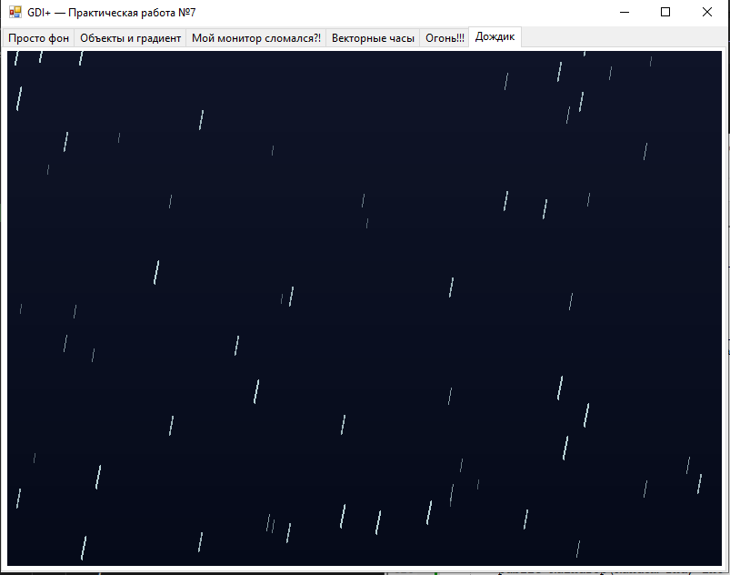

# code

### Form1
```
using System;
using System.Drawing;
using System.Drawing.Drawing2D;
using System.Drawing.Imaging;
using System.Runtime.InteropServices;
using System.Windows.Forms;

namespace WindowsFormsBigLessonTask
{
    public partial class Form1 : Form
    {
        
        private enum ShapeType { Rectangle, Triangle, Ellipse }
        private ShapeType _currentShape = ShapeType.Rectangle;

        
        private bool _isSelecting = false;
        private Point _selStart, _selEnd;
        private Rectangle _prevRect;

        
        private Bitmap _fireBitmap;
        private int[] _firePixels;
        private const int FIRE_W = 200;
        private const int FIRE_H = 150;
        private readonly Random _rnd = new Random();
        private static readonly Color[] _firePalette = BuildFirePalette();

        
        private Bitmap _bgImage;

        
        private Raindrop[] _raindrops;
        private const int DROP_COUNT = 120;

        public Form1()
        {
            InitializeComponent();
            this.DoubleBuffered = true;

            
            try
            {
                string imgPath = System.IO.Path.Combine(
                    System.IO.Path.GetDirectoryName(Application.ExecutablePath), "bc04.jpg");
                _bgImage = new Bitmap(imgPath);
            }
            catch { _bgImage = null; }

            InitFire();
            InitRain();
        }


        private void panel1_Paint(object sender, PaintEventArgs e)
        {
            Graphics g = e.Graphics;
            g.SmoothingMode = SmoothingMode.AntiAlias;
            Panel p = (Panel)sender;
            Rectangle rect = new Rectangle(0, 0, p.Width, p.Height);

            
            if (_bgImage != null)
                g.DrawImage(_bgImage, rect);
            else
            {
                using (LinearGradientBrush br = new LinearGradientBrush(
                    rect, Color.DarkSlateBlue, Color.MidnightBlue, LinearGradientMode.Vertical))
                    g.FillRectangle(br, rect);
            }

            
            using (SolidBrush overlay = new SolidBrush(Color.FromArgb(100, 0, 0, 0)))
                g.FillRectangle(overlay, rect);

            
            Font titleFont = new Font("Segoe UI", 30, FontStyle.Bold);
            string title = "HELLO WORLD!";
            RectangleF titleRect = new RectangleF(0, p.Height / 2 - 70, p.Width, 70);
            using (LinearGradientBrush textBrush = new LinearGradientBrush(
                new Rectangle(0, p.Height / 2 - 70, p.Width, 70),
                Color.Gold, Color.OrangeRed, LinearGradientMode.Horizontal))
            {
                StringFormat sf = new StringFormat
                {
                    Alignment = StringAlignment.Center,
                    LineAlignment = StringAlignment.Center
                };
                g.DrawString(title, titleFont, textBrush, titleRect, sf);
            }
            titleFont.Dispose();
        }


        private void btnRectangle_Click(object sender, EventArgs e)
        {
            _currentShape = ShapeType.Rectangle;
            panel2.Invalidate();
        }
        private void btnTriangle_Click(object sender, EventArgs e)
        {
            _currentShape = ShapeType.Triangle;
            panel2.Invalidate();
        }
        private void btnEllipse_Click(object sender, EventArgs e)
        {
            _currentShape = ShapeType.Ellipse;
            panel2.Invalidate();
        }

        private void panel2_Paint(object sender, PaintEventArgs e)
        {
            Graphics g = e.Graphics;
            g.SmoothingMode = SmoothingMode.AntiAlias;
            Panel p = (Panel)sender;

            
            g.FillRectangle(Brushes.DimGray, 0, 0, p.Width, p.Height);

            int margin = 50;
            int w = p.Width - margin * 2;
            int h = p.Height - margin * 2 - 50;
            Rectangle rect = new Rectangle(margin, margin, w, h);

            using (LinearGradientBrush br = new LinearGradientBrush(
                rect, Color.DeepSkyBlue, Color.MediumVioletRed, LinearGradientMode.ForwardDiagonal))
            using (Pen pen = new Pen(Color.White, 2))
            {
                if (_currentShape == ShapeType.Rectangle)
                {
                    g.FillRectangle(br, rect);
                    g.DrawRectangle(pen, rect);
                }
                else if (_currentShape == ShapeType.Triangle)
                {
                    Point[] pts = {
                        new Point(margin + w / 2, margin),
                        new Point(margin, margin + h),
                        new Point(margin + w, margin + h)
                    };
                    g.FillPolygon(br, pts);
                    g.DrawPolygon(pen, pts);
                }
                else // Ellipse
                {
                    g.FillEllipse(br, rect);
                    g.DrawEllipse(pen, rect);
                }
            }


            using (Font f = new Font("Segoe UI", 11))
            using (SolidBrush sb = new SolidBrush(Color.White))
            {
                StringFormat sf = new StringFormat { Alignment = StringAlignment.Center };
                g.DrawString("Выберите фигуру:", f, sb,
                    new RectangleF(0, p.Height - 45, p.Width, 20), sf);
            }
        }


        private void panel3_MouseDown(object sender, MouseEventArgs e)
        {
            _isSelecting = true;
            _selStart = e.Location;
            _selEnd = e.Location;
            _prevRect = Rectangle.Empty;
        }

        private void panel3_MouseMove(object sender, MouseEventArgs e)
        {
            if (!_isSelecting) return;
            
            if (_prevRect.Width > 0 && _prevRect.Height > 0)
                ControlPaint.FillReversibleRectangle(_prevRect, Color.White);
            _selEnd = e.Location;
            Point screenPt = panel3.PointToScreen(new Point(
                Math.Min(_selStart.X, _selEnd.X),
                Math.Min(_selStart.Y, _selEnd.Y)));
            _prevRect = new Rectangle(
                screenPt.X, screenPt.Y,
                Math.Abs(_selEnd.X - _selStart.X),
                Math.Abs(_selEnd.Y - _selStart.Y));
            if (_prevRect.Width > 0 && _prevRect.Height > 0)
                ControlPaint.FillReversibleRectangle(_prevRect, Color.White);
        }

        private void panel3_MouseUp(object sender, MouseEventArgs e)
        {
            if (!_isSelecting) return;
            _isSelecting = false;
            if (_prevRect.Width > 0 && _prevRect.Height > 0)
                ControlPaint.FillReversibleRectangle(_prevRect, Color.White);
            _prevRect = Rectangle.Empty;
        }


        private void timer1_Tick(object sender, EventArgs e)
        {
            panel4.Invalidate();
        }

        private void panel4_Paint(object sender, PaintEventArgs e)
        {
            Graphics g = e.Graphics;
            g.SmoothingMode = SmoothingMode.AntiAlias;
            Panel p = (Panel)sender;

            int cx = p.Width / 2;
            int cy = p.Height / 2;
            int r = Math.Min(p.Width, p.Height) / 2 - 30;

            
            using (SolidBrush faceBrush = new SolidBrush(Color.FromArgb(30, 30, 60)))
                g.FillEllipse(faceBrush, cx - r, cy - r, r * 2, r * 2);
            using (Pen rimPen = new Pen(Color.SteelBlue, 4))
                g.DrawEllipse(rimPen, cx - r, cy - r, r * 2, r * 2);

            
            for (int i = 0; i < 12; i++)
            {
                double angle = i * 30 * Math.PI / 180.0;
                int len = (i % 3 == 0) ? 12 : 6;
                int x1 = (int)(cx + (r - len) * Math.Sin(angle));
                int y1 = (int)(cy - (r - len) * Math.Cos(angle));
                int x2 = (int)(cx + r * Math.Sin(angle));
                int y2 = (int)(cy - r * Math.Cos(angle));
                using (Pen mp = new Pen(Color.White, (i % 3 == 0) ? 2.5f : 1.5f))
                    g.DrawLine(mp, x1, y1, x2, y2);
            }

            DateTime now = DateTime.Now;
            double secA  = now.Second * 6.0 * Math.PI / 180.0;
            double minA  = (now.Minute * 6.0 + now.Second * 0.1) * Math.PI / 180.0;
            double hourA = ((now.Hour % 12) * 30.0 + now.Minute * 0.5) * Math.PI / 180.0;

            
            DrawHand(g, cx, cy, hourA, (int)(r * 0.5), Color.White, 6);
            DrawHand(g, cx, cy, minA, (int)(r * 0.72), Color.LightBlue, 3);
            DrawHand(g, cx, cy, secA, (int)(r * 0.88), Color.OrangeRed, 1.5f);

            
            using (SolidBrush cb = new SolidBrush(Color.OrangeRed))
                g.FillEllipse(cb, cx - 6, cy - 6, 12, 12);

           
            using (Font f = new Font("Consolas", 14, FontStyle.Bold))
            using (SolidBrush sb = new SolidBrush(Color.White))
            {
                StringFormat sf = new StringFormat { Alignment = StringAlignment.Center };
                g.DrawString(now.ToString("HH:mm:ss"), f, sb,
                    new RectangleF(cx - 70, cy + r * 60 / 100, 140, 28), sf);
            }
        }

        private void DrawHand(Graphics g, int cx, int cy, double angle, int len, Color color, float width)
        {
            int ex = (int)(cx + len * Math.Sin(angle));
            int ey = (int)(cy - len * Math.Cos(angle));
            using (Pen pen = new Pen(color, width) { StartCap = LineCap.Round, EndCap = LineCap.Round })
                g.DrawLine(pen, cx, cy, ex, ey);
        }


        private static Color[] BuildFirePalette()
        {
            Color[] pal = new Color[256];
            for (int i = 0; i < 256; i++)
            {
                int r = Math.Min(255, i * 3);
                int gv = Math.Max(0, i * 2 - 255);
                int b  = 0;
                pal[i] = Color.FromArgb(r, gv, b);
            }
            return pal;
        }

        private void InitFire()
        {
            _firePixels = new int[FIRE_W * FIRE_H];
            _fireBitmap = new Bitmap(FIRE_W, FIRE_H);
        }

        private void timer2_Tick(object sender, EventArgs e)
        {
            UpdateFirePixels();
            RenderFireToBitmap();
            panel5.Invalidate();
        }

        private void UpdateFirePixels()
        {
            
            for (int x = 0; x < FIRE_W; x++)
                _firePixels[(FIRE_H - 1) * FIRE_W + x] = _rnd.Next(180, 256);

            
            for (int y = FIRE_H - 2; y >= 0; y--)
            {
                for (int x = 0; x < FIRE_W; x++)
                {
                    int b1 = _firePixels[(y + 1) * FIRE_W + ((x - 1 + FIRE_W) % FIRE_W)];
                    int b2 = _firePixels[(y + 1) * FIRE_W + x];
                    int b3 = _firePixels[(y + 1) * FIRE_W + ((x + 1) % FIRE_W)];
                    int b4 = (y + 2 < FIRE_H) ? _firePixels[(y + 2) * FIRE_W + x] : b2;
                    int avg = (b1 + b2 + b3 + b4) / 4 - 1;
                    _firePixels[y * FIRE_W + x] = Math.Max(0, avg);
                }
            }
        }

        private void RenderFireToBitmap()
        {
            BitmapData bd = _fireBitmap.LockBits(
                new Rectangle(0, 0, FIRE_W, FIRE_H),
                ImageLockMode.WriteOnly,
                PixelFormat.Format32bppArgb);
            int[] pixels = new int[FIRE_W * FIRE_H];
            for (int i = 0; i < _firePixels.Length; i++)
            {
                Color c = _firePalette[_firePixels[i]];
                pixels[i] = (255 << 24) | (c.R << 16) | (c.G << 8) | c.B;
            }
            Marshal.Copy(pixels, 0, bd.Scan0, pixels.Length);
            _fireBitmap.UnlockBits(bd);
        }

        private void panel5_Paint(object sender, PaintEventArgs e)
        {
            Graphics g = e.Graphics;
            Panel p = (Panel)sender;
            g.FillRectangle(Brushes.Black, 0, 0, p.Width, p.Height);
            if (_fireBitmap != null)
            {
                g.InterpolationMode = InterpolationMode.NearestNeighbor;
                g.DrawImage(_fireBitmap, 0, 0, p.Width, p.Height);
            }
        }

        private void InitRain()
        {
            _raindrops = new Raindrop[DROP_COUNT];
            for (int i = 0; i < DROP_COUNT; i++)
                _raindrops[i] = new Raindrop(_rnd, 800, 600);
        }

        private void timer3_Tick(object sender, EventArgs e)
        {
            int w = panel6.Width;
            int h = panel6.Height;
            foreach (Raindrop drop in _raindrops)
            {
                drop.Y += drop.Speed;
                if (drop.Y > h + 20)
                {
                    drop.Y = _rnd.Next(-60, 0);
                    drop.X = _rnd.Next(0, w);
                }
            }
            panel6.Invalidate();
        }

        private void panel6_Paint(object sender, PaintEventArgs e)
        {
            Graphics g = e.Graphics;
            Panel p = (Panel)sender;
            Rectangle rect = new Rectangle(0, 0, p.Width, p.Height);

           
            using (LinearGradientBrush bg = new LinearGradientBrush(
                rect, Color.FromArgb(15, 20, 40), Color.FromArgb(5, 10, 25), LinearGradientMode.Vertical))
                g.FillRectangle(bg, rect);

            
            foreach (Raindrop drop in _raindrops)
            {
                int alpha = Math.Min(255, 60 + drop.Depth * 30);
                using (Pen pen = new Pen(Color.FromArgb(alpha, Color.LightCyan), drop.Size))
                    g.DrawLine(pen,
                        drop.X, (int)drop.Y,
                        drop.X - drop.Depth, (int)(drop.Y + drop.Length));
            }
        }

        protected override void OnFormClosing(FormClosingEventArgs e)
        {
            timer1.Stop();
            timer2.Stop();
            timer3.Stop();
            if (_fireBitmap != null) _fireBitmap.Dispose();
            if (_bgImage != null) _bgImage.Dispose();
            base.OnFormClosing(e);
        }
    }


    public class Raindrop
    {
        public int X;
        public float Y;
        public float Speed;
        public float Size;
        public int Depth;
        public int Length;

        public Raindrop(Random rnd, int maxW, int maxH)
        {
            X = rnd.Next(0, maxW);
            Y = rnd.Next(0, maxH);
            Depth = rnd.Next(1, 6);
            Speed = 3f + Depth * 1.5f + (float)rnd.NextDouble() * 2f;
            Size = 0.5f + Depth * 0.3f;
            Length = 6 + Depth * 4;
        }
    }
}

```

# result








