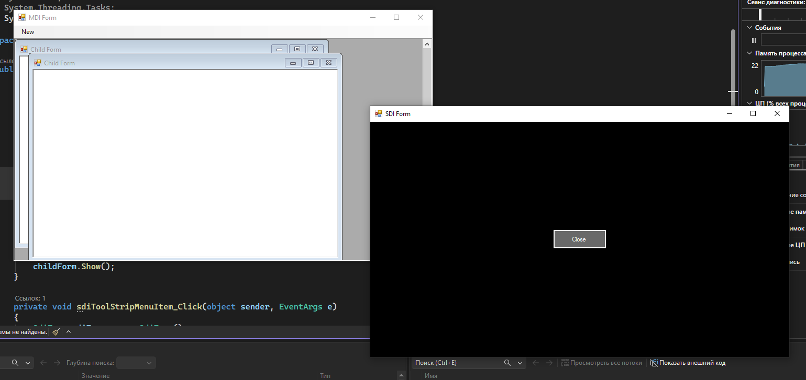

# code

### Form1
```
using System;
using System.Collections.Generic;
using System.ComponentModel;
using System.Data;
using System.Drawing;
using System.Linq;
using System.Text;
using System.Threading.Tasks;
using System.Windows.Forms;

namespace WindowsFormsLessonTask2
{
    public partial class Form1 : Form
    {
        public Form1()
        {
            InitializeComponent();
            this.MainMenuStrip = this.menuStrip1;
        }

        private void Form1_Load(object sender, EventArgs e)
        {
        }

        private void mdiToolStripMenuItem_Click(object sender, EventArgs e)
        {
            ChildForm childForm = new ChildForm();
            childForm.MdiParent = this;
            childForm.Show();
        }

        private void sdiToolStripMenuItem_Click(object sender, EventArgs e)
        {
            SdiForm sdiForm = new SdiForm();
            sdiForm.Show();
        }
    }
}

```

###ChildForm
```
using System;
using System.Collections.Generic;
using System.ComponentModel;
using System.Data;
using System.Drawing;
using System.Linq;
using System.Text;
using System.Threading.Tasks;
using System.Windows.Forms;

namespace WindowsFormsLessonTask2
{
    public partial class ChildForm : Form
    {
        public ChildForm()
        {
            InitializeComponent();
        }
    }
}

```

###SdiForm 
```
using System;
using System.Windows.Forms;

namespace WindowsFormsLessonTask2
{
    public partial class SdiForm : Form
    {
        public SdiForm()
        {
            InitializeComponent();
        }

        private void SdiForm_Load(object sender, EventArgs e)
        {
            CenterCloseButton();
        }

        private void SdiForm_Resize(object sender, EventArgs e)
        {
            CenterCloseButton();
        }

        private void CenterCloseButton()
        {
            btnClose.Left = (this.ClientSize.Width  - btnClose.Width)  / 2;
            btnClose.Top  = (this.ClientSize.Height - btnClose.Height) / 2;
        }

        private void btnClose_Click(object sender, EventArgs e)
        {
            this.Close();
        }
    }
}

```
# result

