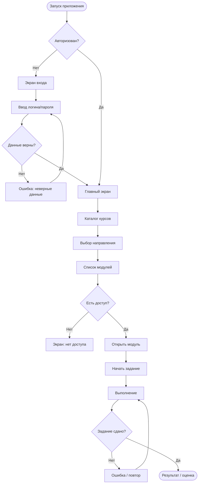

# Часть 12 — Пользовательские сценарии и User Flow (040626)

## Приложение: учебная платформа (мобильное приложение)

---

## User Flow — схема (Mermaid)

---

## Легенда схемы

| Фигура | Значение |
|--------|----------|
| Овал `([...])` | Начало / конец сценария |
| Прямоугольник `[...]` | Экран или действие |
| Ромб `{...}` | Условие / решение системы |
| Стрелка `-->` | Переход между экранами |
| Стрелка с подписью `-- текст -->` | Переход при выполнении условия |

---

## Пользовательские сценарии

### Сценарий 1 — Авторизация (основной путь)

| Элемент | Описание |
|---------|----------|
| Пользователь | Студент, у которого есть аккаунт |
| Цель | Войти в приложение |
| Стартовая точка | Экран входа |
| Основные шаги | 1. Открывает приложение → 2. Вводит логин и пароль → 3. Нажимает «Войти» → 4. Попадает на главный экран |
| Возможная проблема | Неверный пароль — показывается ошибка |
| Результат | Пользователь авторизован, видит главный экран |

### Сценарий 2 — Открытие модуля и начало задания

| Элемент | Описание |
|---------|----------|
| Пользователь | Авторизованный студент |
| Цель | Найти нужный модуль и приступить к заданию |
| Стартовая точка | Главный экран |
| Основные шаги | 1. Открывает каталог → 2. Выбирает направление → 3. Выбирает модуль → 4. Нажимает «Начать» → 5. Выполняет задание |
| Возможная проблема | Модуль недоступен (нет подписки) — экран с объяснением |
| Результат | Задание выполнено, получена оценка |

### Сценарий 3 — Проблемный путь: нет доступа к модулю

| Элемент | Описание |
|---------|----------|
| Пользователь | Студент без доступа к платному модулю |
| Цель | Открыть модуль |
| Стартовая точка | Список модулей |
| Основные шаги | 1. Нажимает на модуль → 2. Система проверяет доступ → 3. Доступа нет → показывается экран блокировки |
| Возможная проблема | Пользователь не понимает почему заблокировано |
| Результат | Экран с объяснением и кнопкой для получения доступа |

---

## Таблица экранов, переходов и условий

| Экран | Действие пользователя | Условие | Следующий экран |
|-------|-----------------------|---------|-----------------|
| Запуск | — | Авторизован | Главный экран |
| Запуск | — | Не авторизован | Экран входа |
| Экран входа | Ввод данных + «Войти» | Данные верны | Главный экран |
| Экран входа | Ввод данных + «Войти» | Данные неверны | Ошибка (тот же экран) |
| Главный экран | Нажать «Каталог» | — | Каталог курсов |
| Каталог курсов | Выбрать направление | — | Список модулей |
| Список модулей | Выбрать модуль | Есть доступ | Экран модуля |
| Список модулей | Выбрать модуль | Нет доступа | Экран блокировки |
| Экран модуля | Нажать «Начать» | — | Задание |
| Задание | Отправить ответ | Верно | Результат / оценка |
| Задание | Отправить ответ | Неверно | Ошибка + повтор |
